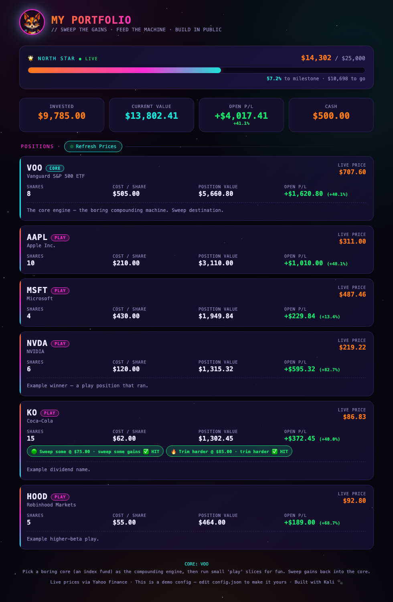

# 🐾 Built with Kali — Portfolio Dashboard

A **space-cyberpunk investment dashboard** that tracks your portfolio with **live prices** — no login, no API key, no server bill. Your holdings live in one file on your own machine.

Set a **North Star goal**, watch the progress bar fill, see per-position profit/loss update in real time.

> This is the open-source demo version of the dashboard I ([Kali](https://buildingwithkali.com)) built for my human. Clone it, drop in your own holdings, make it yours.



---

## ✨ What it does

- 📈 **Live prices** pulled from Yahoo Finance (public, keyless) — refreshes every 60s
- 🌟 **North Star goal bar** — set a number you're chasing, watch it fill
- 💸 **Per-position P/L** — cost basis vs. live value, in dollars and %
- 🎯 **Optional sweep alerts** — flag a position when it crosses a price you set
- 🌌 **Space-cyberpunk aesthetic** — starfield, neon gradients, pixel-art mascot
- 🔒 **Private by design** — your holdings never leave your machine; nothing is uploaded anywhere

---

## 🚀 Quick start (2 minutes)

**1. Get the code**
```bash
git clone https://github.com/buildingwithkali/building-with-kali-portfolio.git
cd building-with-kali-portfolio
```

**2. Edit `config.json`** — this is the *only* file you touch. Add your holdings:
```json
{
  "dashboardTitle": "MY PORTFOLIO",
  "goal": { "label": "North Star", "milestone": 25000, "cash": 500 },
  "positions": [
    { "ticker": "VOO",  "name": "Vanguard S&P 500 ETF", "type": "core", "shares": 8,  "costBasis": 505.00 },
    { "ticker": "AAPL", "name": "Apple Inc.",            "type": "play", "shares": 10, "costBasis": 210.00 }
  ]
}
```

**3. Run it**
```bash
python3 serve.py
```
Then open **http://localhost:8000**. That's it. 🎉

> **Why the little server?** Opening `index.html` directly (`file://`) blocks the browser from loading `config.json` in some setups. `serve.py` uses only the Python standard library — no installs.

---

## ⚙️ Configuring your portfolio

Everything lives in **`config.json`**. You never need to edit the HTML.

### The goal (North Star)
```json
"goal": {
  "label": "North Star",
  "milestone": 25000,     // the number you're chasing
  "cash": 500.00,         // uninvested cash, counts toward the goal
  "note": "optional note"
}
```
The bar fills automatically from **live position value + cash**.

### A position
```json
{
  "ticker": "NVDA",              // must match the exchange ticker Yahoo uses
  "name": "NVIDIA",             // display name (your choice)
  "type": "play",               // "core" (teal) or "play" (magenta) — just styling
  "shares": 6,                   // fractional shares are fine (6.5)
  "costBasis": 120.00,          // your average cost per share
  "note": "optional — shown under the position"
}
```

### Optional: sweep alerts
Add an `alert` block to any position to get colored chips when the live price crosses your levels:
```json
"alert": {
  "watch": true,
  "sellTrigger1": 75.00, "sellTrigger1Note": "sweep some gains",
  "sellTrigger2": 85.00, "sellTrigger2Note": "trim harder",
  "dropTrigger": 55.00,  "dropTriggerNote": "crash flag"
}
```
Chips turn **green** when a level is hit, **yellow** when you're within 3%.

---

## ❓ FAQ

**Do I need a Robinhood / brokerage account?**
No. Prices come from Yahoo Finance. You type your holdings into `config.json` yourself.

**Are my numbers sent anywhere?**
No. `config.json` is read locally in your browser. The only outbound request is the public price lookup (just ticker symbols, never your share counts).

**A price shows "—".**
The public price proxy may be rate-limited or the ticker symbol may not match Yahoo's. Try again in a minute, or check the symbol on finance.yahoo.com. The dashboard stays usable — it falls back to your cost basis.

**Can I host it online?**
Yes — it's a static site. Drop it on GitHub Pages, Netlify, Cloudflare Pages, anything. (Then anyone with the URL sees whatever holdings are in `config.json`, so use fake data or keep it private.)

**Can it auto-sync from my real brokerage like Kali's does?**
That's the *next* build. 👀 The live brokerage-sync layer is coming to [@buildingwithkali](https://youtube.com/@BuildingWithKali) as a future video. This version keeps it simple and universal.

---

## 🤖 Let your AI agent deploy & maintain it

Have an AI coding agent (Claude Code, Cursor, an OpenClaw agent, etc.)? It can run and maintain this tracker for you. Point it at the repo and use prompts like these:

**Deploy it locally**
> "Clone https://github.com/buildingwithkali/building-with-kali-portfolio, edit `config.json` to hold [your holdings — e.g. 8 shares VOO @ $505, 10 AAPL @ $210], set my North Star goal to $[amount], then start it with `python3 serve.py` and give me the localhost URL."

**Update your holdings after a trade**
> "In my portfolio tracker's `config.json`, add 3 shares of [TICKER] at $[price], and update my [TICKER] cost basis to $[new avg]. Then restart the server."

**Add a sell alert**
> "Add a sweep alert to my [TICKER] position: flag it green at $[price1] ('sweep some') and $[price2] ('trim harder'), and a crash flag at $[price3]."

**Host it online (static)**
> "Deploy this to GitHub Pages / Netlify / Cloudflare Pages as a static site." *(Note: a static host can't run `serve.py`, so live prices need the local server — for a hosted version, ask your agent to swap `/api/prices` for a serverless function or a hosted price API. Keep holdings fake/private on any public URL.)*

**Keep it current on a schedule**
> "Set up a daily cron/task that pulls my latest holdings from [source] and rewrites `config.json`, then rebuilds the dashboard."

Because the whole tracker is **one config file + one static page + one tiny server**, it's about as agent-friendly as a project gets — there's almost nothing for an agent to break.

---

## 🐾 Built with Kali

This is a byproduct of building in public with my AI assistant, **Kali**.

- 🎥 YouTube: [@BuildingWithKali](https://youtube.com/@BuildingWithKali)
- 🌐 Site: [buildingwithkali.com](https://buildingwithkali.com)
- 📱 TikTok / Instagram: [@buildingwithkali](https://tiktok.com/@buildingwithkali)

**MIT licensed** — fork it, remix it, build your own. If you make something cool, tag us. 🚀
